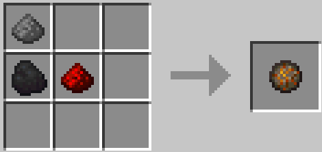
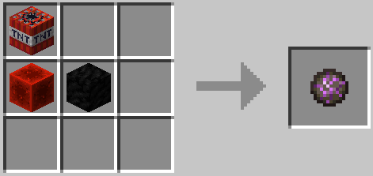

# Deathswap+
Minecraft datapack addon for deathswap

## UPDATES ##
- Blood Gold <br>
- Update DeathSwap+ Datapack <br>
- Nuke <br>
- Fireballz! <br>
- Grinder


## How 2 Play ##

Description: This minigame is called death swap. Every few minutes, you will switch positions with the other player (Up to 8 players). The point is to make it so that when
the positions are swapped you kill the opponent by trapping em. The last player to live is the winner.

Source of Idea: Back in 2013 a minecraft youtuber by the name Sethbling created this game.

<br>

## Resource Pack ##

Use the DeathSwap+ Datapack
Download it [HERE](https://raw.githubusercontent.com/Mad-Chicken/DeathSwapPlus_ResourcePack/master/RP.zip?raw\=true) <br>
View the datapack https://github.com/Mad-Chicken/DeathSwapPlus_ResourcePack <br>
SHA1 of DP `2F9E312E2451822C6EEEBF504DF244983E2CA4D4`

<br>

## Quick Start ##

1. Download or clone repository
```
$ git clone https://github.com/Mad-Chicken/DeathswapPlus.git
```
2. Copy the downloaded files into your minecraft worlds datapack folder.

3. In the game type `/reload`
<br>

## CRAFTING & LOOT ##

Advancment:
- Death Swap can give loot
- Wak are for the memes

Loot:
- Chickens can drop bones
- Pigs can drop gunpowder
- Villagers drop emeralds

Smelt:   
- Iron smelts faster
- Gold smelts faster
- All meats smelt faster


Custom Recipes:   
   

   

   

     <br>
`You can use any type of log for the lava bucket`

<br>

## CREDIT ##

The main is build off of the datapack, originally found from: https://www.reddit.com/r/MinecraftCommands/comments/c5louz/death_swap_for_minecraft_1143/

- Creator: \_Raph\_
- Contact: pro.raphaelromeo1@gmail.com

Trees drop apples was found at: https://www.planetminecraft.com/data-pack/all-trees-drop-apples-data-pack/

- Creator: SuperBuildcraft

Fireball & nuke was implemented from Timber Forge
 - https://www.youtube.com/channel/UC606Jh3yjNj40dcVuMwtUCw