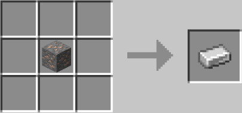
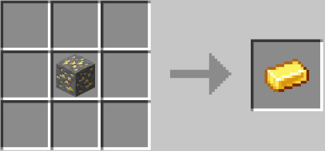

# Deathswap+
Minecraft function addon for deathswap

<h2>CREDIT</h2>
The main is build off of the datapack, originally found from: https://www.reddit.com/r/MinecraftCommands/comments/c5louz/death_swap_for_minecraft_1143/

- Creator: \_Raph\_
- Contact: pro.raphaelromeo1@gmail.com

Trees drop apples was found at: https://www.planetminecraft.com/data-pack/all-trees-drop-apples-data-pack/

- Creator: SuperBuildcraft

<h2>How 2 Play</h2>
Description: This minigame is called death swap. Every few minutes, you will switch positions with the other player (Up to 8 players). The point is to make it so that when
the positions are swapped you kill the opponent by trapping em. The last player to live is the winner.

Source of Idea: Back in 2013 a minecraft youtuber by the name Sethbling created this game.

<h2>CRAFTING</h2>

Inventory Smelt:   
     

Craft mob eggs for traps:    
   

Other custom recipes:    
  
     
`You can use any type of log`