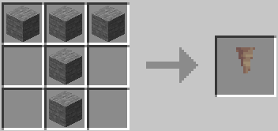
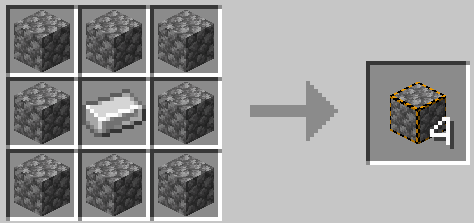

# Deathswap+

Minecraft datapack addon for deathswap

## How 2 Play

Description: This minigame is called death swap. Every few minutes, you will switch positions with the other player (Up to 8 players). The point is to make it so that when
the positions are swapped you kill the opponent by trapping em. The last player to live is the winner.

Source of Idea: Back in 2013 a minecraft youtuber by the name [Sethbling](https://www.youtube.com/channel/UC8aG3LDTDwNR1UQhSn9uVrw) created this game.

## Resource Pack

Use the DeathSwap+ Datapack
[Download from this repository](https://github.com/andrew-aiken/DeathswapPlus/tree/version/1.19/ReasourcePack)

## Installation

### Quick Start

1. Download the latest release

2. Move the ZIP into the minecraft worlds datapack folder

### Build from Source

1. Clone repository

```sh
git clone https://github.com/Mad-Chicken/DeathswapPlus.git
```

2. Edit the `sandstone.config.ts` DeathswapPlus directory. Set `saveOptions.path` to the minecraft worlds datapack directory.

3. In the same directory run the following commands

```sh
npm install
npm run build
```

<br>

## CRAFTING & LOOT

Advancement:

- Death Swap can give loot
- Wak are for the memes

Custom Drops:

- Bats
- Bees
- Chickens
- Pigs
- Villagers

Smelt:

- Iron smelts faster
- Gold smelts faster
- All meats smelt faster


Custom Recipes:   
   

   

   

    <br>
`Silver fish block & dripstone can be crafted with stone or cobblestone`<br>
`Fireball use 'custom crafting' which can only replace a crafting item, the items will be called jigsaw`

<br>

## CREDIT

The main is build off of the datapack, originally found from:
[https://www.reddit.com/r/MinecraftCommands/comments/c5louz/death_swap_for_minecraft_1143/](https://www.reddit.com/r/MinecraftCommands/comments/c5louz/death_swap_for_minecraft_1143/)

- Creator: \_Raph\_
- Contact: pro.raphaelromeo1@gmail.com

Trees drop apples was found at: https://www.planetminecraft.com/data-pack/all-trees-drop-apples-data-pack/

- Creator: SuperBuildcraft

Fireball & nuke was implemented from Timber Forge:
https://www.youtube.com/channel/UC606Jh3yjNj40dcVuMwtUCw

## Crafts

powder snow
  craft


Idea:

- Boots that cause fire?
