# Deathswap+
Minecraft datapack addon for deathswap

<h2>UPDATES</h2>
- New drops for entities
- Added new Wak advancment  
- New crafting recipes

<h2>How 2 Play</h2>
Description: This minigame is called death swap. Every few minutes, you will switch positions with the other player (Up to 8 players). The point is to make it so that when
the positions are swapped you kill the opponent by trapping em. The last player to live is the winner.

Source of Idea: Back in 2013 a minecraft youtuber by the name Sethbling created this game.

<h2>CRAFTING & LOOT</h2>

Advancment:
- Death Swap can give loot
- Wak are for the memes

Loot:
- Chickens can drop bones
- Pigs can drop gunpowder

Smelt:   
- Iron smelts faster
- Gold smelts faster
- All meats smelt faster
- Leather can be smelted into rotton flesh

Custom Recipes:   
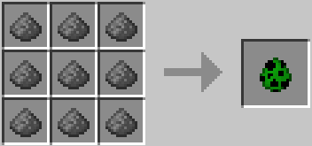 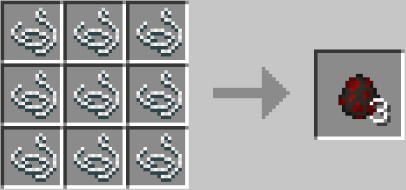 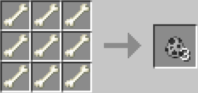 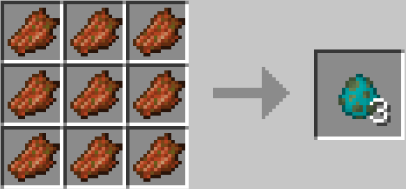

 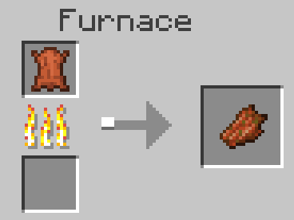 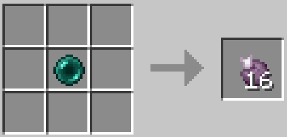 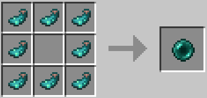

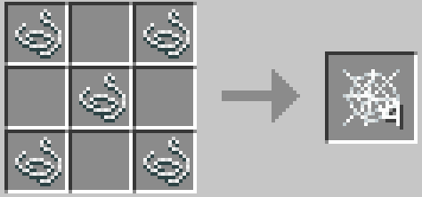 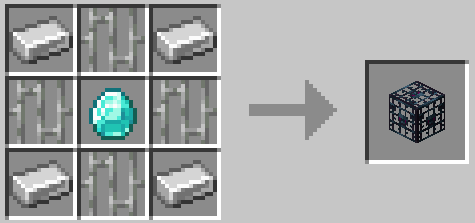 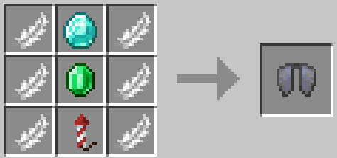 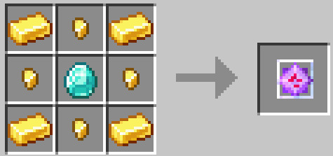

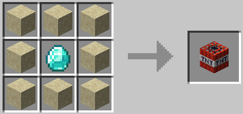 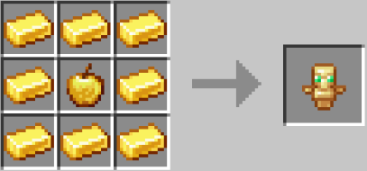 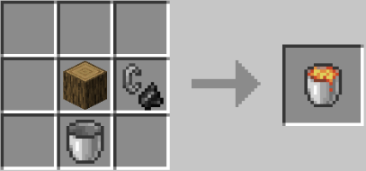  
`You can use any type of log for the lava bucket`

 

<h2>CREDIT</h2>
The main is build off of the datapack, originally found from: https://www.reddit.com/r/MinecraftCommands/comments/c5louz/death_swap_for_minecraft_1143/

- Creator: \_Raph\_
- Contact: pro.raphaelromeo1@gmail.com

Trees drop apples was found at: https://www.planetminecraft.com/data-pack/all-trees-drop-apples-data-pack/

- Creator: SuperBuildcraft
